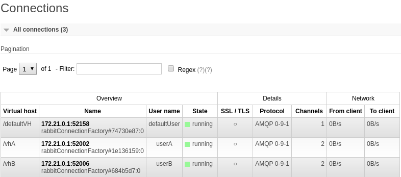
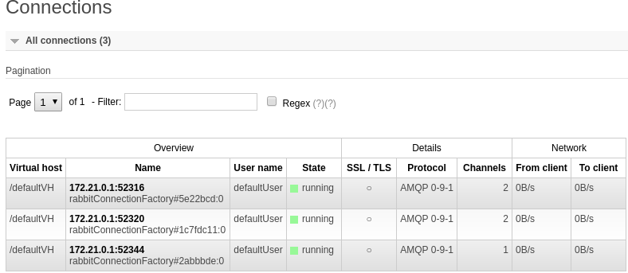

Demo to show an issue when using the spring-cloud config-service with spring-cloud-stram and multiple binders.

When the demoservice is started with 
`spring.cloud.config.enabled=false`

everything is fine:
 

But when using the config-service, which is delivering the exact same config file:

 

All bindings refer to the default connection which only real purpose  should be to override the default credentials for the actuator health endpoint.

# Workaround
As described here:

[https://github.com/spring-cloud/spring-cloud-stream/issues/1124](https://github.com/spring-cloud/spring-cloud-stream/issues/1124) 

It works if the `spring.rabbitmq.*` settings are stored in the local config _**BUT NOT**_ in the remote config.

